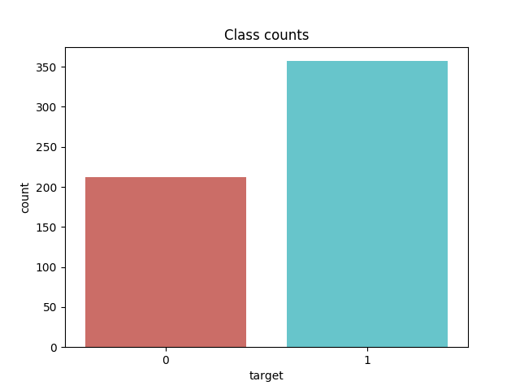
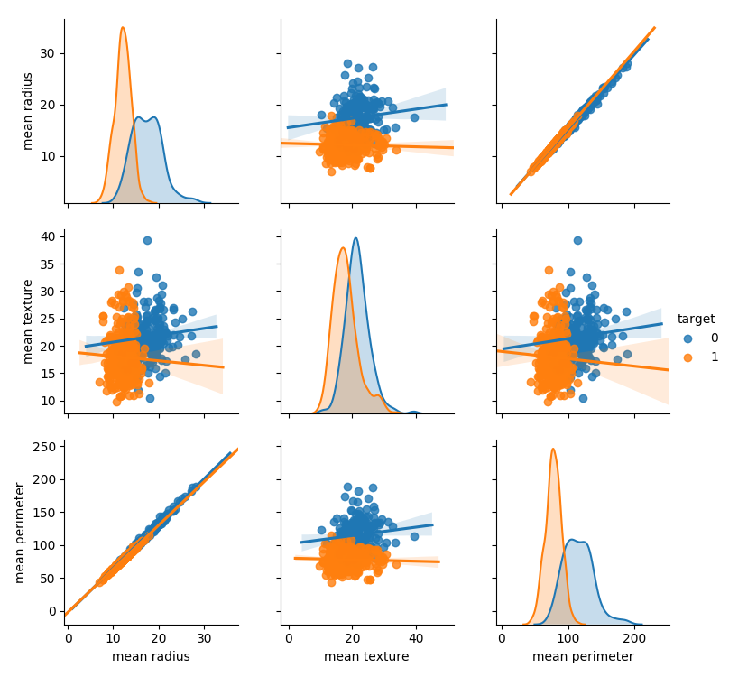

# final_project

Application of Logistic Regression to Predict Patients with Breast Cancer. 

| Name | Date |
|:-------|:---------------|
|Van Quang Nguyen | March 25, 2019|

-----

### Resources
This repository includes the following:

- Python script for your analysis: pscript.py
- Results figure/saved file: Correlation_matrix.png, count_plot.png, ROC.png
- Dockerfile for your experiment: Dockerfile
- runtime-instructions in a file named RUNME.md

- Data: in this folder, we provide a test data in the form of a csv file.

-----

## Research Question

Based on a provided dataset on breast cancer, can we  
predict if patients with provided information is malignant or benign.

### Abstract

Based on the UCI ML Breast Cancer Wisconsin (Diagnostic) datasets and 
visualization tools of Seaborn, we study the correlation among features 
to have the first insight on the data. From the visualization, we decide 
to use the logistic regression as a model to predicting future patients. 
We provide a python script to return a prediction once users provide 
enough information. We packed this code into a Docker container such 
that it could be used by others easily.

### Introduction

This project aims to use the Breast Cancer Wisconsin (Diagnostic) 
dataset with 569 samples. Each sample is assigned to an unique 
identification (ID) and belongs to one of two classes: Malignant (M) 
or Benign (B). One sample consists of 30 numerical-valued 
features including: radius, texture, perimeter, area, smoothness, 
compactness, concavity, concave points, symmetry, and fractal 
dimension, all are sampled with mean, standard error, and largest. 

As described in [1], 
Features are computed from a digitized image of a fine needle aspirate
(FNA) of a breast mass. They describe characteristics of the cell 
nuclei present in the image.

However, when we load the dataset with the built tool in sklearn, 
we get two numpy arrays: data (containing numeric values of features) 
and target (containig information on (integer) either 0 or 1). 
Two other lists: target_names and features_name which are lists of strings.

### Methods

First, we explore data by counting values of each class:

To have the insight on the correlation among features, we used 
seaborn and matplotlib libraries, designed for Python language, to 
plot the correlation matrix

Some pairplots will then be used to 
visualize the other relations

We decided to use the logistic regression model in scikit-learn to build a 
classifier from which users can use to predict their class with 
their information. 

The reason to choose this regressor are because of its simplicity and 
effectiveness. Besides, from the visualization, we did not observe a 
linear relation and hence, although much simpler, linear classification 
was not be used in our project. Traditionally, logistic regression 
(even with "regression" word in its name) is a statistical model using 
logistic function (see [2]) 
to deal with dependent variables with two possible outcomes which fits 
perfectly our data set (two classes). It is a modification of the 
linear classifier and has been used effectively for long-term 
(see [3]) 

### Results

The performance of the classification is reported as follow:
 
        Precision: 0.980

        Recall: 0.973

        F1: 0.976
This indicates that our model can predict with the accuracy arount 98%.
We furthermore plot the Receiver operating characteristic (ROC)

The blue line, representing the prediction probability, lies away from 
the dash red line showing that our model is a good choice. 

### Discussion

In this project, by using visualization tools in Python, we decide 
to use the logistic regression with L2 regularizer on the Wisconsin Breast Cancer (Diagnosis) 
Dataset to predict the class for patients using their information. From 
the mathematical point of view, this is a smooth and convex optimization 
problem. Many possible algorithms are available, both deterministic as 
well as stochastic. In our project, we use the deterministic newton 
algorithm with conjugate gradient due to its fast convergence.

In the future work, we intend to use another model besides logistic regression 
to explore the dataset. More specifically, more general objective functions 
will be studies instead of logistic function added by a ridge regularizer. 
 

### References
[1]. https://archive.ics.uci.edu/ml/machine-learning-databases/breast-cancer-wisconsin/breast-cancer-wisconsin.names

[2]. https://en.wikipedia.org/wiki/Logistic_function

[3]. https://amstat.tandfonline.com/doi/abs/10.1080/01621459.1975.10480319#.XJU6Qi0ZM0p

-------
